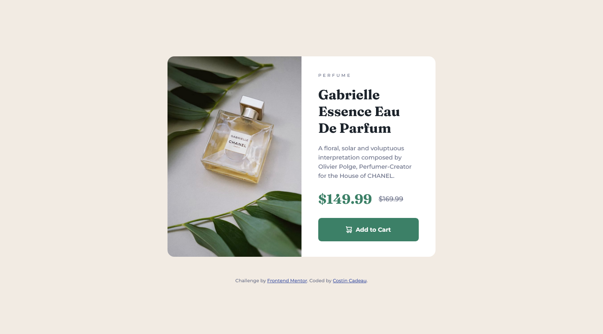

# Frontend Mentor - Product preview card component solution

This is a solution to the [Product preview card component challenge on Frontend Mentor](https://www.frontendmentor.io/challenges/product-preview-card-component-GO7UmttRfa). Frontend Mentor challenges help you improve your coding skills by building realistic projects. 

## Table of contents

- [Overview](#overview)
  - [The challenge](#the-challenge)
  - [Screenshot](#screenshot)
  - [Links](#links)
- [My process](#my-process)
  - [Built with](#built-with)
  - [What I learned](#what-i-learned)
  - [Useful resources](#useful-resources)
- [Author](#author)

## Overview

### The challenge

Users should be able to:

- View the optimal layout depending on their device's screen size
- See hover and focus states for interactive elements

### Screenshot

**_Version mobile:_**


**_Version desktop :_**



### Links

- Solution URL: [Add solution URL here](https://your-solution-url.com)
- Live Site URL: [Add live site URL here](https://your-live-site-url.com)

## My process

### Built with

- Semantic HTML5 markup
- BEM CSS Method
- Mobile-first workflow
- Flexbox

### What I learned

I learned, use multiple image via the `<picture></picture>` markup
```html
<picture>
    <source media="(max-width:640px)" srcset="image.jpg">
    <source media="(min-width:640px)" srcset="big-image.jpg">
    
</picture>
```

### Useful resources

- [MDN Web Docs](https://developer.mozilla.org/en-US/docs/Web/HTML/Element/picture) - This helped me for use markup `<picture></picture>`

## Author

- Website - [costincadeau.fr](https://costincadeau.fr)
- Frontend Mentor - [@c-costin](https://www.frontendmentor.io/profile/c-costin)
